

  

                                        

  <h1 align="center">Project Name: Home Eatery</h1>
  <h2 align ="center">Course Number: CSE 486 
  Section:01 
  Semester: Fall 2020  
  Faculty Name: Shaikh Shawon Arefin Shimon</h2>
  <h3 align="center">Student Name: Md Abir Hossain 

  Student ID: 1731597042 
  Email: abir.hossain04@northsouth.edu   
  Date prepared: 21/01/2020</h3>   

<h2> Project Name: Home Eatery </h2> 
<h3 id="table-of-contents">Table of contents</h3>

<ol>
  <a href="#introduction"><li>Introduction</li> </a>
  <a href="#features"><li>Features</li> </a>
  <a href="#data"><li>Data Management</li> </a>
  <a href="#Design"><li>Design Pattern</li></a> 
  <a href="#conclusion"><li>Roadblocks</li></a> 

</ol>
 

<h2 id="#introduction">1. Introduction</h2>
<h3>1.1 Project Idea:</h3>

In Dhaka and other Cities/towns in Bangladesh - food catering for office goers and events are a big issue. For health concerns, more and more people prefer lunch meals and event catering from home chefs. This business need has given rise to many solutions like FoodTong (https://foodtong.co/) , which provides a digital service to connect home chefs with different customers. This app is one single food ordering platform app that serves both chefs and the customers. Customer and chefs/vendor will be able to login from the same app (as different users)

<h2 id="features">2. Features</h2>
This project has the following features -
<!--user regestration-->
<h3>2.1User Registration:</h3>
  To access any platform users first have to register. Users must include userimage,username, firstname, lastname,email and password, phone number, address.
    
    
 

  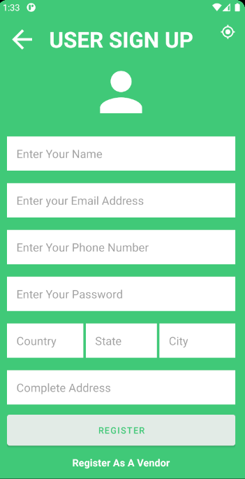 
 

 <!--vendor regestration-->
 If the user is a vendor then he/she have to give some aditional information. Vendor must include delivery fee,shop name. 
  

 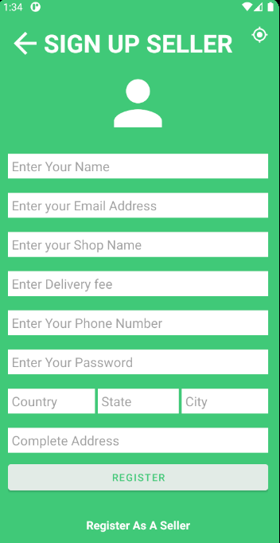 
 

 <h3>2.2 Login :</h3>
  Clients and vendors will have to login by providing their email and password 
   

  

 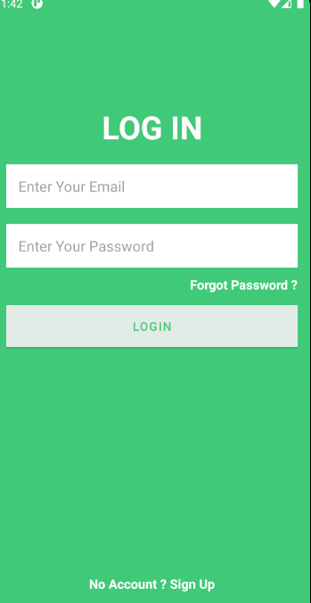 

<h3>2.3 Forgot Password:</h3>
  Clients and vendors will be able to reset their passwords if they forgets their password 
   

  

  

 
 
  <h3>2.4 Currently the following functions are available for clients -</h3>
  

    * Clients can see all the restaurants that are nearby them. 
      

 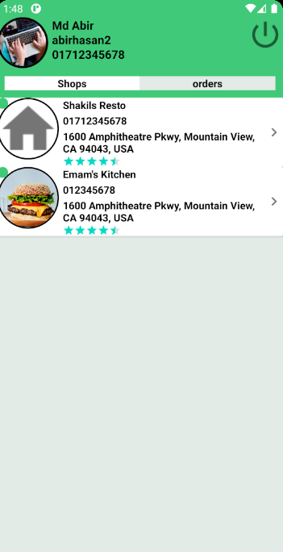 

* Clients can enter those restaurants and see the details of those restaurants and the food items that are available there  
 

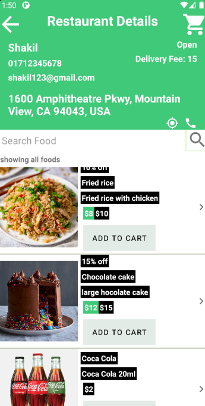 

 * Clients can search foods by name or by category  

 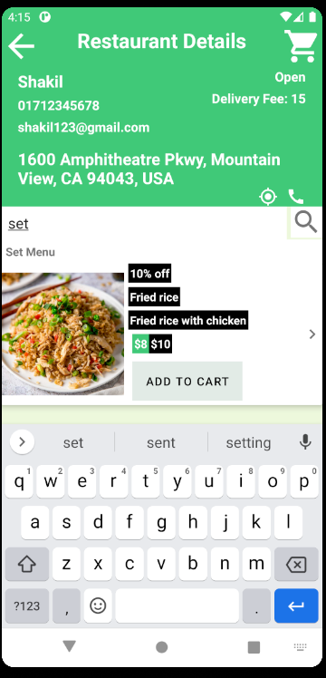 

 

 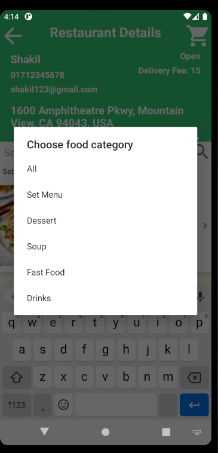 

 * Clients can can select those foods and add those foods to their cart
 
 

  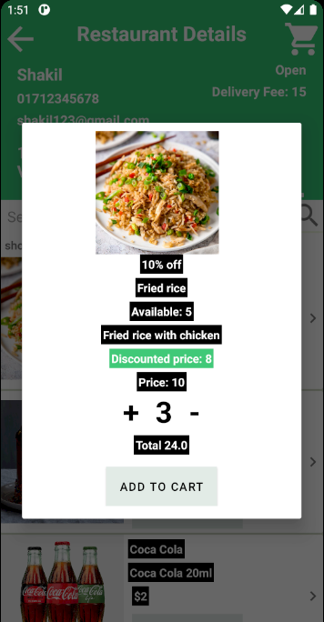 

  
<h3>2.5 Vendor Side:</h3>
There is also a vendor side in this app 
* Vendors will be able to see all the foods that are available when they logs in

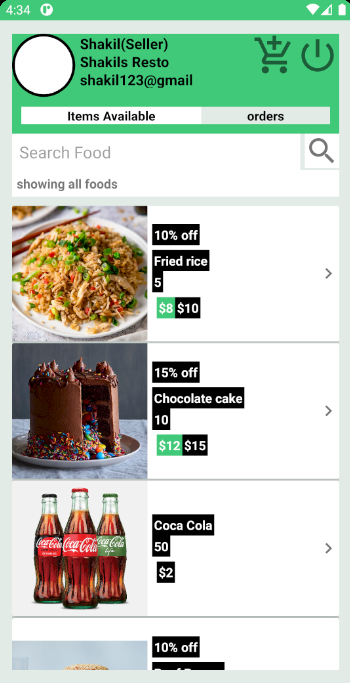 

* Vendors will be able to add food items

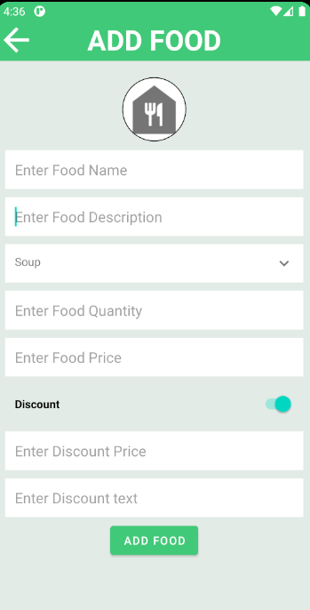 

* Vendors will be search foods by category or name

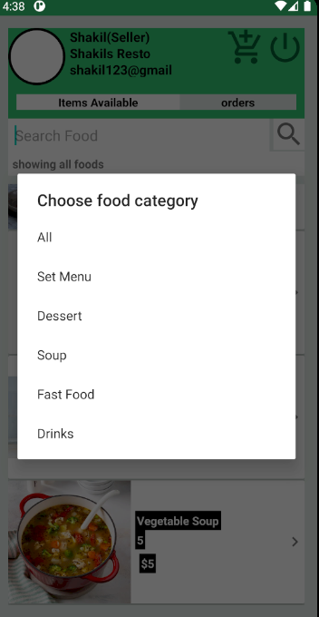 

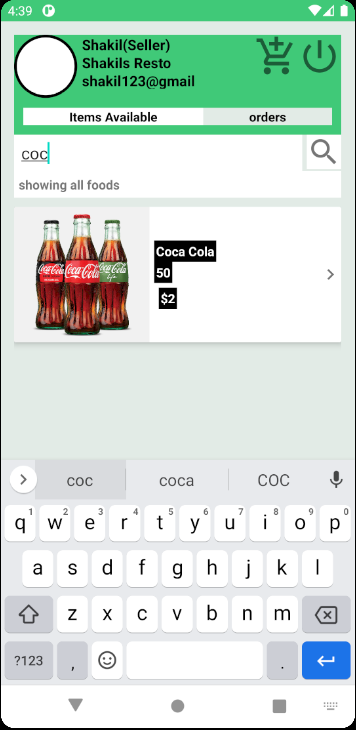 

* Vendors will be search remove foods

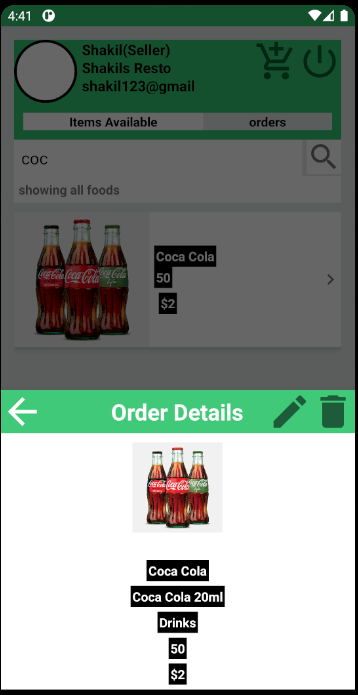 

 <h2 id="#data">3.Data Management</h2>
 
For Data management i have used both firebase and sqlite. In this app firebase was widely used.Firebase is Google's mobile platform that helps you quickly develop high-quality apps and grow your business. This apps login registration is done by firebase authentication.Realtime Database is Firebase's original database. It's an efficient, low-latency solution for mobile apps that require synced states across clients in realtime. I used firebase realtime database to keep the user data. And for storing the images i used firebase storage.Cloud Storage for Firebase is a powerful, simple, and cost-effective object storage service built for Google scale. Sqlite was used to store the cart items that user was storing in his app 

<h2 id="#Design">4. Design Pattern</h2>

No design pattern was followed for making this app. Firebase database is a noSql database and it stores data in tree format.

<h2>5. Conclusion</h2>

In summary Populace is a web-based software that tries to organize life by bringing several platforms together. In this project we achieved most of the functionalities proposed. Except the Business monetization plan using Google-AdSense. We also didn't implement the function of being able to post to the specific platform in this version of the software. During the development process we faced issues trying to integrate Google-classroom. The method of using the API with Google-Oauth did not work out. As a result we decided to go with the auto-generated credentials file by Google instead of using our own credential file. These maybe a issue when we go live with the site. In future, we plan to implement these missing functionalities,come up with better solution for the implementation and make the platform even better.
