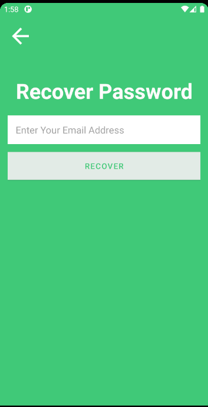

  

                                        

  <h1 align="center">Project Name: Home Eatery</h1>
  <h2 align ="center">Course Number: CSE 486 
  Section:01 
  Semester: Fall 2020  
  Faculty Name: Shaikh Shawon Arefin Shimon</h2>
  <h3 align="center">Student Name: Md Abir Hossain 

  Student ID: 1731597042 
  Email: abir.hossain04@northsouth.edu   
  Date prepared: 21/01/2020</h3>   

<h2> Project Name: Home Eatery </h2> 
<h3 id="table-of-contents">Table of contents</h3>

<ol>
  <a href="#introduction"><li>Introduction</li> </a>
  <a href="#features"><li>Features</li> </a>
  <a href="#technology"><li>Data Management</li> </a>
  <a href="#businessplan"><li>Design Pattern</li></a> 
  <a href="#conclusion"><li>Roadblocks</li></a> 

</ol>
 

<h2 id="#introduction">1. Introduction</h2>
<h3>1.1 Project Idea:</h3>

In Dhaka and other Cities/towns in Bangladesh - food catering for office goers and events are a big issue. For health concerns, more and more people prefer lunch meals and event catering from home chefs. This business need has given rise to many solutions like FoodTong (https://foodtong.co/) , which provides a digital service to connect home chefs with different customers. This app is one single food ordering platform app that serves both chefs and the customers. Customer and chefs/vendor will be able to login from the same app (as different users)

<h2 id="features">2. Features</h2>
This project has the following features -
<!--user regestration-->
<h3>2.1User Registration:</h3>
  To access any platform users first have to register. Users must include userimage,username, firstname, lastname,email and password, phone number, address.
    
    
 

   
 

 <!--vendor regestration-->
 If the user is a vendor then he/she have to give some aditional information. Vendor must include delivery fee,shop name. 
  

  
 

 <h3>2.2 Login :</h3>
  Clients and vendors will have to login by providing their email and password 
   

  

  

<h3>2.3 Forgot Password:</h3>
  Clients and vendors will be able to reset their passwords if they forgets their password 
   

  

  

 
 
  <h3>2.4 Currently the following functions are available for clients -</h3>
  

    * Clients can see all the restaurants that are nearby them. 
      

  

* Clients can enter those restaurants and see the details of those restaurants and the food items that are available there  
 

 

 * Clients can search foods by name or by category  

  

 

  

 * Clients can can select those foods and add those foods to their cart
 
 

   

  
<h3>2.5 Vendor Side:</h3>
There is also a vendor side in this app

 

 <h2 id="#technology">3. Technology</h2>
 <h3>3.1 Proposed Technology Stack: </h3>
 
For UI design we decided to use Bootstrap. Bootstrap is a free and open-source CSS framework directed at responsive front-end web development. It contains CSS and JavaScript-based design templates for typography, forms, buttons, navigation and other interface components. Bootstrap will be used over the usual HTML and CSS. And for the backend we will be using Express.js. It is a web application framework. It is a minimal and flexible Node.js web application framework that provides robust set of features.

 Finally, for the database requirement we have opted to use a NoSQL database. And so we have decided to use MongoDB for the projects database requirement.  The reason for doing so is because we have only three entities:

<ul>
    <li> USER: Will keep info about the users signing in the application. </li>
    <li>PLATFORM: The platform information for the signed in USER entity.</li>
    <li>COURSE_INFO: The name of the course/subject associated with the specific platform</li>
</ul> 

 <h3>3.2 Implemented Technology Stack: </h3>
 
Due to npm api for piazza being old and unusable we have decided to switch our project from node.js to Django.For which our project specification has changed. Django is a high level python-based free and open-source web framework.

 For the database requirement we have opted to use a SQL database that comes with Django by default And so we have decided to use sqlite3 for the projects database requirement.

<h5>3.2.1 Design Pattern: </h5>
 
By default the Django framework follows the model-view-template pattern which a close immitation of the Model-view-controller. We decided to stay with this MVT pattern
To get the data from the other platforms we used the following APIs–

  * [Google Classroom Link](https://developers.google.com/classroom/quickstart/python)
  * [Piazza Link](https://pypi.org/project/piazza-api/) 

<h2 id="businessplan">4. BusinessPlan/Monetization</h2>

Google AdSense is the easiest way to monetize a website. It is designed for website developers to display photos, videos, texts on their website.  There are different types of ads available in Google AdSense. If our website is Google AdSense approved, Google will post ads on our website. Therefore, we can earn per view. On the other hand, our website can also be used by universities, schools and colleges as a means for them to communicate with their students, so we can make these organizations use our website as their own personal site. It will help the students in their studies. Because they will find Google classroom and piazza in one platform. It will save their time and keep them organized. So we can also approach these educational institutions to adopt our site to their system.

<h2>5. Conclusion</h2>

In summary Populace is a web-based software that tries to organize life by bringing several platforms together. In this project we achieved most of the functionalities proposed. Except the Business monetization plan using Google-AdSense. We also didn't implement the function of being able to post to the specific platform in this version of the software. During the development process we faced issues trying to integrate Google-classroom. The method of using the API with Google-Oauth did not work out. As a result we decided to go with the auto-generated credentials file by Google instead of using our own credential file. These maybe a issue when we go live with the site. In future, we plan to implement these missing functionalities,come up with better solution for the implementation and make the platform even better.
